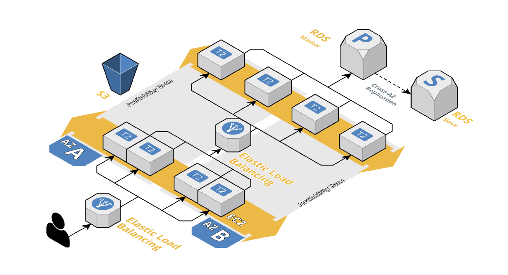
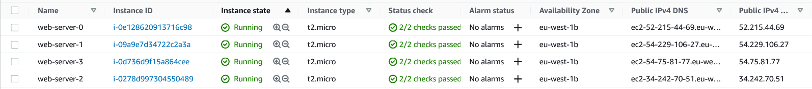
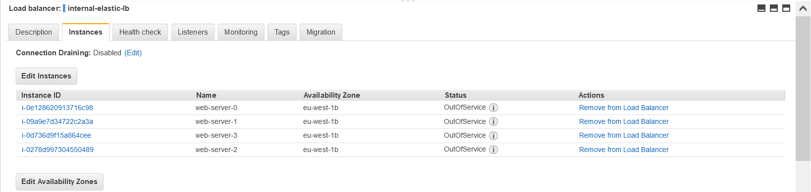
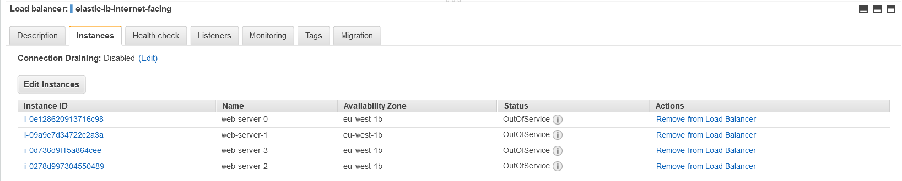
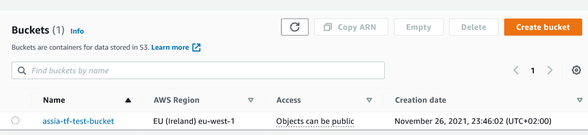
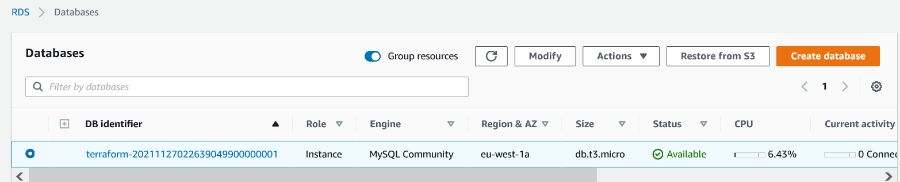
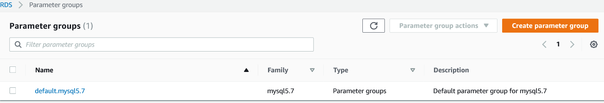

# AWS EC2/ELB/S3/RDS DB Terraform module
## Features

This module aims to implement:
* 2 Load Balancers - Internet Facing and Internal.
* 4 Web Servers.
* RDS with MySQL DB.
* S3 Bucket.

All supported by AWS and latest stable version of Terraform.


## Use it
- Clone this repo
    ```https://github.com/assiakhateeb/Terraform-Task2.git```
- Download [Amazon AWS](http://aws.amazon.com/) and add your credentials (Access Key & Secret Key)

## Code Commit
1. Initialization (Installation of provider libraries) <br>
`terraform init`
2. Check results of script before applying changes <br>
`terraform plan`
3. Apply Changes <br>
`terraform apply`

## Providers

| Name | Version |
|------|---------|
| <a name="provider_aws"></a> [aws](https://registry.terraform.io/providers/hashicorp/aws/latest/docs) | Terraform 0.13 and later |


## Resources

| Name | Type |
|------|------|
| [aws_default_vpc](https://registry.terraform.io/providers/hashicorp/aws/latest/docs/resources/default_vpc) | resource |
| [aws_elb_attachment ](https://registry.terraform.io/providers/hashicorp/aws/latest/docs/resources/elb_attachment) | resource |
| [aws_ami ](https://registry.terraform.io/providers/hashicorp/aws/latest/docs/data-sources/ami) | data source |
| [aws_instance](https://registry.terraform.io/providers/hashicorp/aws/latest/docs/resources/instance)  | resource |
| [aws_elb](https://registry.terraform.io/providers/hashicorp/aws/latest/docs/resources/elb) | resource |
| [aws_db_instance](https://registry.terraform.io/providers/hashicorp/aws/latest/docs/resources/db_instance)  | resource |
| [aws_s3_bucket](https://registry.terraform.io/providers/hashicorp/aws/latest/docs/resources/s3_bucket)  | resource |


### Instances


### ELB - Internal 


### ELB - Internet Facing 


### S3 Bucket


### RDS - DB

<br>
